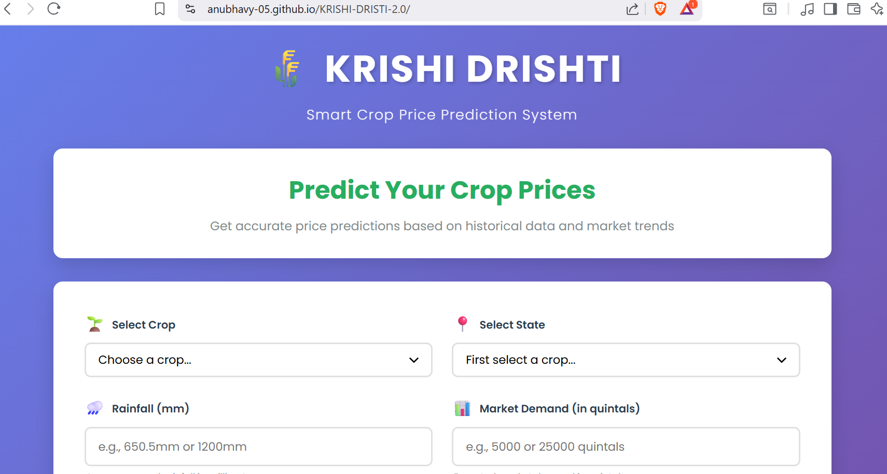

# 🌾 KRISHI-DRISTI 2.0 - Crop Price Prediction System

A smart web-based application for predicting crop prices based on various agricultural and market factors.

[](https://anubhavy-05.github.io/KRISHI-DRISTI-2.0/)
[](https://vercel.com/new/clone?repository-url=https://github.com/anubhavy-05/KRISHI-DRISTI-2.0)

## 🚀 Features

- **8 Major Crops Supported**: Wheat, Paddy (Rice), Cotton, Maize, Arhar, Moong, Mustard, and Sugarcane
- **Multi-State Coverage**: Predictions for major agricultural states in India
- **Smart Price Prediction**: ML-based algorithm considering multiple factors:
  - Rainfall patterns
  - Market demand
  - Seasonal variations
  - State-specific factors
  - Year-based trends
- **Interactive UI**: Beautiful, responsive design that works on all devices
- **Real-time Insights**: Get market insights and confidence scores with predictions

## 📊 How It Works

1. Select your crop
2. Choose the state
3. Enter rainfall data (in mm)
4. Input market demand (in quintals)
5. Select year and month
6. Get instant price prediction with confidence score and market insights

## 🛠️ Technologies Used

- **HTML5** - Structure
- **CSS3** - Styling with modern gradients and animations
- **JavaScript** - Price prediction algorithm and interactivity

## 📁 Project Structure

```
NEW-KRISHI/
│
├── index.html          # Main HTML file
├── styles.css          # CSS styling
├── script.js           # JavaScript logic
└── README.md           # Documentation
```

## 🌐 Live Demo

**🔗 [View Live Website](https://anubhavy-05.github.io/KRISHI-DRISTI-2.0/)**

Click the button above or visit: `https://anubhavy-05.github.io/KRISHI-DRISTI-2.0/`

### 📸 Website Preview
The website is live and fully functional! Visit the link above to:
- ✅ Predict crop prices for 8 different crops
- ✅ Get market insights based on rainfall and demand
- ✅ View interactive price prediction charts
- ✅ Access from any device (mobile, tablet, desktop)

> **Note**: Upload a screenshot as `screenshot.png` in the repository root to display it here.

## 💻 Local Development

Simply open `index.html` in any modern web browser. No build process or dependencies required!

Or use a local server:

```bash
# Python
python -m http.server 8000

# Node.js
npx http-server -p 8000
```

Then visit: `http://localhost:8000`

## 📱 Screenshots



## 🎯 Price Prediction Algorithm

The system uses a sophisticated algorithm that considers:

- **Base Prices**: Historical average prices for each crop
- **Demand Factor**: Market demand in quintals (0-1M range)
- **Rainfall Impact**: Optimal rainfall ranges for each crop
- **State Variations**: Regional price differences
- **Seasonal Effects**: Harvest vs off-season pricing
- **Inflation Adjustment**: Year-over-year price changes

## 🤝 Contributing

Contributions are welcome! Feel free to:

1. Fork the repository
2. Create your feature branch (`git checkout -b feature/AmazingFeature`)
3. Commit your changes (`git commit -m 'Add some AmazingFeature'`)
4. Push to the branch (`git push origin feature/AmazingFeature`)
5. Open a Pull Request

## 📝 License

Copyright (c) 2025 anubhavy-05. All Rights Reserved.

This project is proprietary software. No copying, distribution, or modification is permitted without explicit permission from the author. See the [LICENSE](LICENSE) file for details.

## 👨‍💻 Author

**@anubhavy-05**
- GitHub: [@anubhavy-05](https://github.com/anubhavy-05)
- Repository: [KRISHI-DRISTI-2.0](https://github.com/anubhavy-05/KRISHI-DRISTI-2.0)

## 🙏 Acknowledgments

- Agricultural data patterns based on Indian market research
- UI/UX inspired by modern web design principles
- Built for farmers and agricultural stakeholders

---

**Note**: This is a prediction tool based on statistical models. Actual market prices may vary due to numerous real-time factors.
